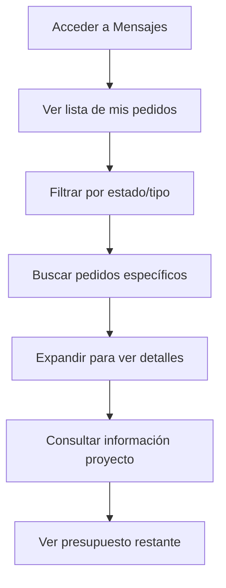
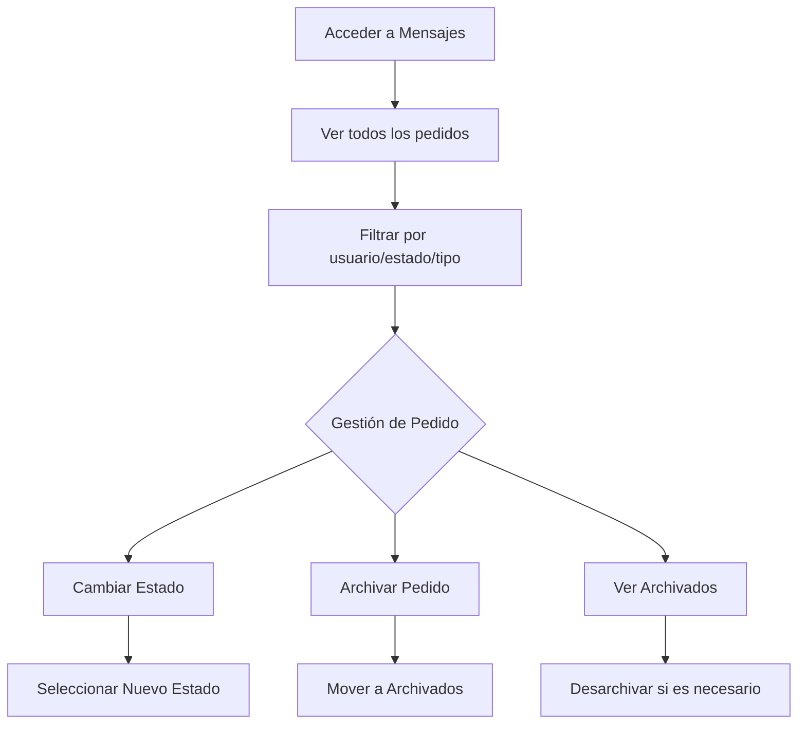
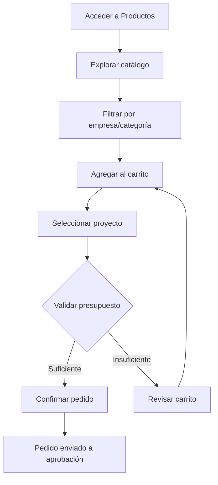
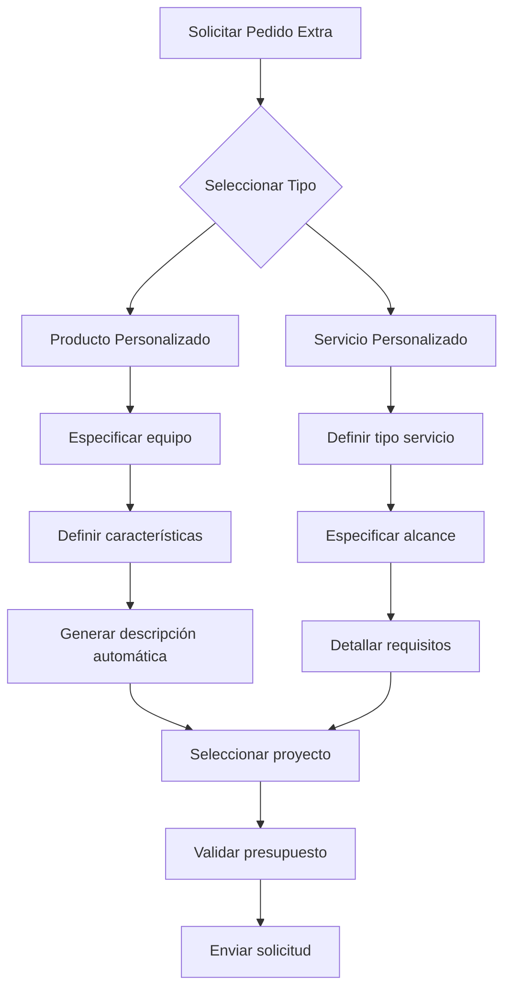
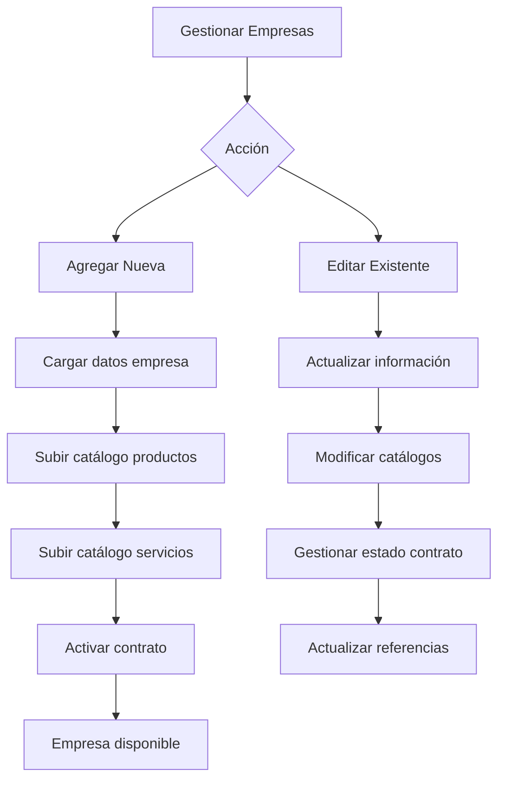
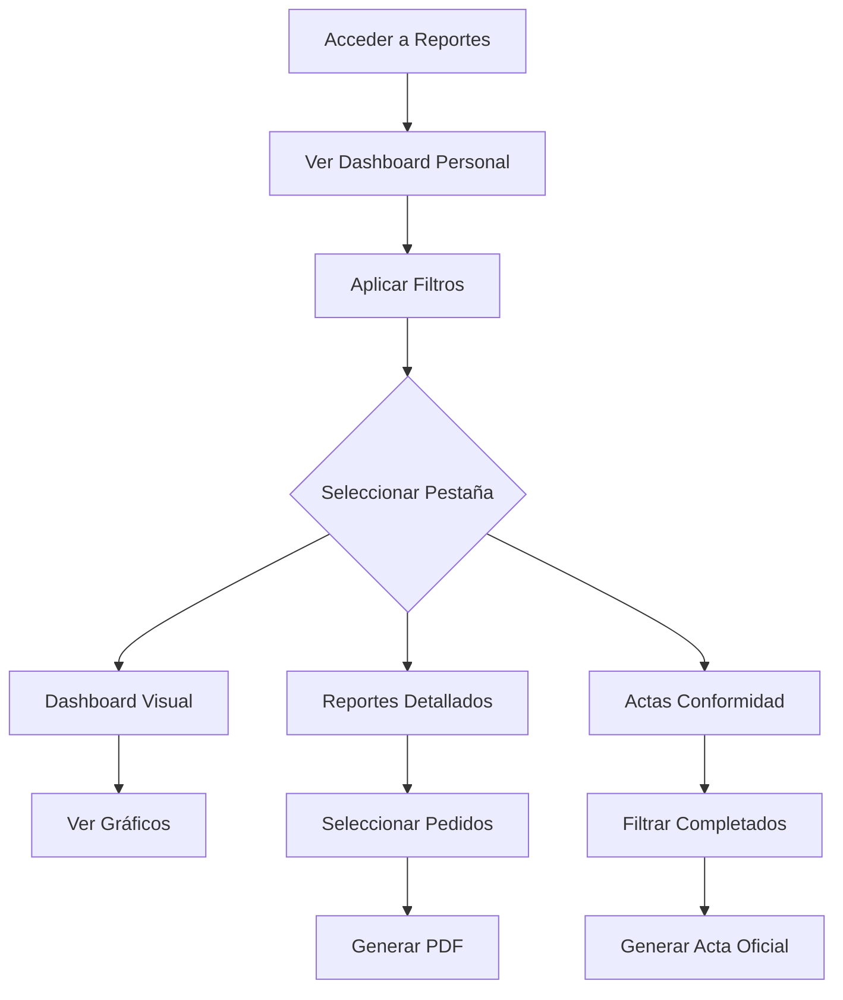
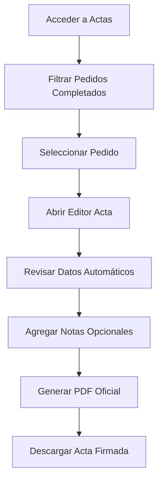
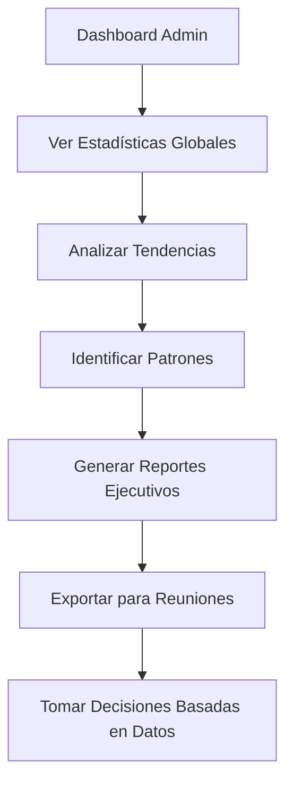

# Documentación Scrum - Interfaz de Mensajes SiPP

## 📋 **Product Backlog**

### **Épica: Gestión de Mensajes y Pedidos**
**Descripción:** Sistema centralizado para gestionar todos los pedidos del sistema como mensajes, con funcionalidades específicas por rol de usuario.

---

## 👥 **Roles de Usuario y Permisos**

### **1. Usuario Regular**
**Permisos:**
- Ver solo sus propios pedidos
- Consultar detalles de sus pedidos
- Ver estado y presupuesto de sus proyectos

### **2. Rol Comercial** 
**Permisos:** (Igual que Administrador)
- Ver todos los pedidos del sistema
- Gestionar estados de pedidos
- Archivar/desarchivar pedidos
- Filtrar por usuarios

### **3. Administrador**
**Permisos:**
- Acceso completo a todos los pedidos
- Todas las funcionalidades de gestión

---

## 📊 **User Stories**

### **Sprint 1: Visualización Básica**
| ID | User Story | Prioridad | Story Points |
|---|------------|-----------|--------------|
| US-01 | Como usuario, quiero ver mis pedidos en una lista organizada | Alta | 5 |
| US-02 | Como usuario, quiero filtrar pedidos por estado y tipo | Media | 8 |
| US-03 | Como usuario, quiero buscar pedidos por texto | Media | 3 |

### **Sprint 2: Gestión de Estados**
| ID | User Story | Prioridad | Story Points |
|---|------------|-----------|--------------|
| US-04 | Como admin/comercial, quiero cambiar estados de pedidos | Alta | 13 |
| US-05 | Como admin/comercial, quiero archivar pedidos | Alta | 8 |
| US-06 | Como admin/comercial, quiero ver pedidos archivados | Media | 5 |

### **Sprint 3: Experiencia de Usuario**
| ID | User Story | Prioridad | Story Points |
|---|------------|-----------|--------------|
| US-07 | Como usuario, quiero ver detalles expandibles de pedidos | Alta | 8 |
| US-08 | Como usuario, quiero interfaz adaptable a modo oscuro/claro | Media | 13 |
| US-09 | Como usuario, quiero iconos intuitivos por tipo/estado | Baja | 5 |

---

## 🔄 **Flujos de Proceso por Rol**

### **🔹 Flujo Usuario Regular**



**Procesos disponibles:**
1. **Visualización de Pedidos**
   - Lista de pedidos propios
   - Filtros por estado (Pendiente, En proceso, Completado, Denegado)
   - Filtros por tipo (Productos, Servicios, Pedidos Extra)
   - Búsqueda por texto

2. **Consulta de Detalles**
   - Información del proyecto
   - Detalles de items del pedido
   - Presupuesto restante
   - Estado actual del pedido

### **🔹 Flujo Administrador/Comercial**



**Procesos disponibles:**

1. **Gestión Completa de Estados**
   ```javascript
   // Estados disponibles
   const statusOptions = [
     'Pendiente',
     'En proceso', 
     'Completado',
     'Denegado',
     'Archivado'
   ];
   ```

2. **Proceso de Denegación**
   ```
   Input: Seleccionar estado "Denegado"
   → Seleccionar motivo predefinido
   → O especificar motivo personalizado
   → Confirmar cambio de estado
   → Notificación al sistema
   ```

3. **Proceso de Archivado**
   ```
   Input: Archivar pedido
   → Mover a sección de archivados
   → Ocultar de vista principal
   → Mantener acceso mediante diálogo especial
   → Posibilidad de desarchivar
   ```

4. **Filtrado Avanzado**
   - Por usuario específico
   - Por estado múltiple
   - Por tipo de pedido
   - Por fecha (implícito)

---

## 🎯 **Criterios de Aceptación**

### **US-04: Cambiar Estados de Pedidos**
** Criterios:**
- [ ] Diálogo modal con opciones de estado
- [ ] Validación de motivo para estado "Denegado"
- [ ] Actualización en tiempo real del estado
- [ ] Notificación de confirmación
- [ ] Persistencia en localStorage

### **US-05: Archivar Pedidos**
** Criterios:**
- [ ] Botón "Archivar" visible para admin/comercial
- [ ] Pedido desaparece de vista principal
- [ ] Acceso mediante botón "Archivados"
- [ ] Posibilidad de desarchivar
- [ ] Estados consistentes entre vistas

### **US-07: Detalles Expandibles**
** Criterios:**
- [ ] Expandir/contraer con click
- [ ] Marcado automático como leído
- [ ] Información completa del pedido
- [ ] Items desglosados con precios
- [ ] Información de contacto DST para completados

---

## 🔧 **Configuración Técnica**

### **Estructura de Datos**
```javascript
// Mensaje/Pedido procesado
const messageStructure = {
  id: "identificador único",
  orderNumber: "PDD-001-24",
  type: "Pedido Normal|Pedido Extra",
  subType: "Productos|Servicios|P.Extra-producto",
  user: "Nombre Usuario",
  area: "Área del usuario",
  project: "Proyecto asociado",
  status: "Pendiente|En proceso|Completado|Denegado|Archivado",
  read: boolean,
  archived: boolean,
  items: [...],
  // ... más propiedades
};
```

### **Persistencia**
- **LocalStorage Keys:**
  - `OASiS_purchases` - Pedidos regulares
  - `OASiS_special_orders` - Pedidos extra
  - `OASiS_messages` - Estados de lectura
  - `SiPP_users` - Información de usuarios
  - `SiPP_projects_{userId}` - Proyectos por usuario

---

## 🎨 **Especificaciones de UI/UX**

### **Estados Visuales**
- **No leído:** Texto en negrita
- **Leído:** Texto normal
- **Expandido:** Fondo destacado
- **Hover:** Efecto de resaltado

### **Iconografía**
- **Estado:** ⏰ Pendiente, ⚠️ En proceso,  Completado, ❌ Denegado, 📁 Archivado
- **Tipo:** 🏪 Productos, 🛠️ Servicios, 📦 Pedidos Extra

### **Colores por Tipo**
- **Productos:** Borgundy (#4E0101)
- **Servicios:** Sapphire (#3C5070)
- **Pedidos Extra:** Tan (#d2b48c)

---

## 📈 **Métricas de Éxito**

### **KPIs Cualitativos**
-  Reducción tiempo gestión pedidos
-  Claridad en estados de pedidos
-  Accesibilidad para diferentes roles
-  Experiencia consistente modo oscuro/claro

### **KPIs Cuantitativos**
- ⏱️ Tiempo promedio cambio estado: < 30 seg
- 📊 Porcentaje uso filtros: > 60%
- 🔍 Tiempo búsqueda pedido: < 15 seg
- 📱 Satisfacción usuario: > 4/5

---

## 🔄 **Workflow de Desarrollo Scrum**

### **Ceremonias**
- **Daily Standup:** Progreso componentes de mensajes
- **Sprint Planning:** Priorización user stories
- **Sprint Review:** Demo nuevas funcionalidades
- **Retrospective:** Mejoras proceso desarrollo

### **Definición de Terminado (DoD)**
- [ ] Código revisado y aprobado
- [ ] Tests unitarios pasando
- [ ] Documentación actualizada
- [ ] Compatibilidad navegadores
- [ ] Performance aceptable
- [ ] Accesibilidad verificada

---

## 🚀 **Releases Planificadas**

### **v1.0 - Funcionalidad Básica**
- Visualización y filtrado
- Gestión estados básica

### **v1.1 - Mejoras UX**
- Modo oscuro completo
- Iconografía mejorada
- Optimización rendimiento

### **v1.2 - Funcionalidades Avanzadas**
- Notificaciones en tiempo real
- Reportes y analytics
- Integración con otros módulos

---

# Documentación Scrum - Módulo de Pedidos SiPP

## 📋 **Product Backlog**

### **Épica: Gestión Integral de Pedidos**
**Descripción:** Sistema completo para gestión de pedidos que incluye catálogos de productos/servicios, pedidos especiales, historial y administración de empresas proveedoras.

---

## 👥 **Roles de Usuario y Permisos**

### **1. Usuario Regular**
**Permisos:**
- Ver catálogos de productos y servicios activos
- Agregar productos/servicios al carrito
- Realizar pedidos regulares
- Solicitar pedidos extra
- Consultar historial personal
- Editar/Eliminar sus propios pedidos

### **2. Rol Comercial** 
**Restricciones:**
- ❌ **NO puede realizar compras**
- Solo acceso de consulta a catálogos
- Puede ver historial general

### **3. Administrador**
**Permisos Completo:**
- Gestión completa de empresas proveedoras
- Carga/edición de catálogos
- Ver todos los pedidos del sistema
- Exportación de datos
- Activación/desactivación de contratos

---

## 📊 **User Stories**

### **Sprint 1: Catálogos y Carrito**
| ID | User Story | Prioridad | Story Points |
|---|------------|-----------|--------------|
| US-P01 | Como usuario, quiero ver productos disponibles con filtros | Alta | 8 |
| US-P02 | Como usuario, quiero agregar productos al carrito | Alta | 5 |
| US-P03 | Como usuario, quiero ver servicios disponibles | Alta | 5 |
| US-P04 | Como usuario, quiero gestionar cantidades en carrito | Media | 3 |

### **Sprint 2: Pedidos Especiales**
| ID | User Story | Prioridad | Story Points |
|---|------------|-----------|--------------|
| US-P05 | Como usuario, quiero solicitar pedidos extra de productos | Alta | 13 |
| US-P06 | Como usuario, quiero solicitar pedidos extra de servicios | Alta | 13 |
| US-P07 | Como usuario, quiero especificar características técnicas | Media | 8 |

### **Sprint 3: Gestión y Historial**
| ID | User Story | Prioridad | Story Points |
|---|------------|-----------|--------------|
| US-P08 | Como usuario, quiero ver mi historial de pedidos | Alta | 8 |
| US-P09 | Como usuario, quiero editar/eliminar mis pedidos | Media | 5 |
| US-P10 | Como admin, quiero gestionar empresas proveedoras | Alta | 13 |

### **Sprint 4: Validaciones y UX**
| ID | User Story | Prioridad | Story Points |
|---|------------|-----------|--------------|
| US-P11 | Como usuario, quiero validación de presupuesto | Alta | 8 |
| US-P12 | Como usuario, quiero interfaz responsive | Media | 8 |
| US-P13 | Como sistema, quiero control de inventario | Alta | 13 |

---

## 🔄 **Flujos de Proceso por Rol**

### **🔹 Flujo Usuario Regular - Pedidos Regulares**



**Procesos disponibles:**
1. **Exploración de Catálogos**
   - Visualización de productos con imágenes
   - Filtros por empresa, categoría, precio
   - Búsqueda por texto
   - Validación de stock y disponibilidad

2. **Gestión de Carrito**
   ```javascript
   // Estados del carrito
   const cartManagement = {
     addItem: 'validar stock y contrato',
     updateQuantity: 'validar límites',
     removeItem: 'actualizar totales',
     clearCart: 'reiniciar selección'
   };
   ```

3. **Proceso de Compra**
   ```
   Input: Seleccionar proyecto
   → Validar presupuesto disponible
   → Calcular total vs presupuesto
   → Verificar stock actual
   → Confirmar envío a aprobación
   → Actualizar inventario
   → Generar notificación
   ```

### **🔹 Flujo Pedidos Extra**



**Procesos para Productos Extra:**
1. **Selección de Equipo**
   - 20+ tipos predefinidos (computadoras, redes, periféricos)
   - Características técnicas específicas por tipo
   - Descripción automática generada

2. **Especificación de Servicios**
   - Tipos: desarrollo, consultoría, mantenimiento, etc.
   - Alcance detallado
   - Requisitos técnicos
   - Plazos de ejecución

### **🔹 Flujo Administrador - Gestión Empresas**



**Procesos Administrativos:**
1. **Alta de Empresas**
   - Información básica (proveedor, empresa, tipo negocio)
   - Carga de catálogos Excel
   - Activación de contrato
   - Configuración de moneda

2. **Gestión de Contratos**
   - Activación/desactivación
   - Actualización en tiempo real
   - Sincronización con pedidos existentes

---

## 🎯 **Criterios de Aceptación**

### **US-P01: Visualización de Productos**
** Criterios:**
- [ ] Mostrar solo productos de empresas con contrato activo
- [ ] Indicar claramente stock disponible
- [ ] Filtros funcionando en tiempo real
- [ ] Imágenes de productos visibles
- [ ] Precios y categorías correctos

### **US-P05: Pedidos Extra Productos**
** Criterios:**
- [ ] Selección de tipo de equipo
- [ ] Características técnicas específicas
- [ ] Generación descripción automática
- [ ] Validación de campos obligatorios
- [ ] Cálculo de prioridad automática

### **US-P10: Gestión Empresas**
** Criterios:**
- [ ] Carga correcta de archivos Excel
- [ ] Validación de formatos de plantilla
- [ ] Actualización de referencias en pedidos
- [ ] Notificación de cambios
- [ ] Exportación de datos

---

## 🔧 **Configuración Técnica**

### **Estructuras de Datos Principales**

```javascript
// Producto en Catálogo
const productStructure = {
  id: "identificador único",
  name: "Nombre producto",
  model: "Modelo específico",
  price: "Precio en CUP/MLC",
  image: "URL imagen",
  description: "Descripción detallada",
  stock: "Cantidad disponible",
  availability: "Disponible/Agotado",
  category: "Categoría",
  company: "Empresa proveedora",
  contractActive: "Estado contrato"
};

// Pedido Regular
const purchaseOrder = {
  id: "identificador único",
  orderNumber: "PDD-001-PROD-24",
  userId: "ID usuario solicitante",
  projectId: "Proyecto asociado",
  items: [...productos/servicios],
  total: "Monto total",
  status: "Pendiente/Aprobado/Rechazado",
  priority: "Alta/Media/Baja",
  currency: "CUP/MLC"
};

// Pedido Extra
const specialOrder = {
  orderType: "product/service",
  products: [{ 
    equipmentType: "tipo equipo",
    characteristics: {...},
    description: "descripción generada",
    quantity: "cantidad"
  }],
  services: [...],
  currency: "CUP/MLC"
};
```

### **Persistencia y Almacenamiento**
- **LocalStorage Keys:**
  - `OASiS_catalogs` - Catálogos de empresas
  - `OASiS_purchases` - Pedidos regulares
  - `OASiS_special_orders` - Pedidos extra
  - `OASiS_cart_{userId}` - Carritos de usuario
  - `SiPP_projects_{userId}` - Proyectos por usuario

### **Validaciones de Negocio**

```javascript
// Validación de Presupuesto
const budgetValidation = {
  checkBudget: (projectId, cartTotal) => {
    const budget = getProjectBudget(projectId);
    const spent = getProjectExpenses(projectId);
    const remaining = budget - spent;
    return remaining >= cartTotal;
  }
};

// Control de Inventario
const inventoryControl = {
  updateStock: (productId, quantity) => {
    // Actualizar stock al confirmar pedido
    // Marcar como agotado si stock <= 0
  }
};
```

---

## 🎨 **Especificaciones de UI/UX**

### **Estados Visuales y Feedback**
- **Producto disponible:** Card normal, botones activos
- **Stock bajo:** Indicador amarillo/naranja
- **Agotado:** Card atenuada, botones desactivados
- **Empresa inactiva:** No visible en catálogos

### **Navegación por Pestañas**
1. **Productos** - Catálogo visual con cards
2. **Servicios** - Lista de servicios disponibles
3. **Pedidos Extra** - Formularios especializados
4. **Historial** - Tabla de pedidos realizados
5. **Empresas** - Solo administradores

### **Responsive Design**
- **Mobile:** Cards apiladas verticalmente
- **Tablet:** 2 columnas de cards
- **Desktop:** 3-4 columnas según espacio

---

## 📈 **Métricas de Éxito**

### **KPIs de Usabilidad**
-  Tiempo promedio para realizar pedido: < 2 minutos
-  Tasa de finalización de compra: > 85%
-  Satisfacción con interfaz: > 4.2/5
-  Reducción de errores en pedidos: < 5%

### **KPIs de Negocio**
- ⏱️ Tiempo procesamiento pedidos extra: < 24h
- 📊 Utilización de presupuesto: 70-90% óptimo
- 🔍 Pedidos completados sin modificaciones: > 90%
- 📱 Adopción móvil: > 60% de accesos

---

## 🔄 **Workflow de Desarrollo Scrum**

### **Ceremonias Específicas Módulo Pedidos**
- **Sprint Planning:** Priorización basada en volumen de pedidos
- **Daily Standup:** Seguimiento componentes críticos (carrito, validaciones)
- **Sprint Review:** Demo nuevas funcionalidades con datos reales
- **Retrospective:** Análisis de problemas en flujo de compra

### **Definición de Terminado (DoD) - Módulo Pedidos**
- [ ] Validaciones de presupuesto funcionando
- [ ] Control de inventario actualizado
- [ ] Notificaciones enviadas correctamente
- [ ] Datos persistentes en localStorage
- [ ] Responsive en todos los dispositivos
- [ ] Permisos por rol implementados
- [ ] Exportación de datos funcionando

---

## 🚀 **Releases Planificadas**

### **v1.0 - Funcionalidad Básica**
- Catálogos de productos y servicios
- Carrito de compras básico
- Pedidos regulares

### **v1.1 - Pedidos Avanzados**
- Pedidos extra especializados
- Validaciones de presupuesto
- Historial detallado

### **v1.2 - Gestión Administrativa**
- Panel completo administrador
- Gestión de empresas
- Exportación de reportes
- Configuraciones avanzadas

### **v2.0 - Optimizaciones**
- Integración con otros módulos
- Analytics y reportes avanzados
- Notificaciones en tiempo real
- API para integraciones externas

---

## 🔐 **Reglas de Negocio Críticas**

### **Validaciones Estrictas**
1. **Presupuesto:** No permitir pedidos que excedan presupuesto
2. **Stock:** No permitir compra de productos agotados
3. **Contratos:** Solo empresas con contrato activo visibles
4. **Permisos:** Comerciales no pueden realizar compras
5. **Proyectos:** Pedido debe asociarse a proyecto válido

### **Procesos Automatizados**
- Generación números de pedido únicos
- Cálculo automático de prioridades
- Actualización de inventario en tiempo real
- Sincronización de datos entre vistas

---

# Documentación Scrum - Módulo de Reportes SiPP

## 📋 **Product Backlog**

### **Épica: Sistema de Reportes y Analytics**
**Descripción:** Módulo integral para generación de reportes, análisis de datos y creación de actas de conformidad oficiales.

---

## 👥 **Roles de Usuario y Permisos**

### **1. Usuario Regular**
**Permisos:**
- Ver dashboard personal con estadísticas
- Generar reportes de sus propios pedidos
- Crear actas de conformidad para pedidos completados
- Acceder a gráficos de su actividad

### **2. Rol Comercial** 
**Permisos:**
- Dashboard general del sistema
- Reportes de todos los usuarios (solo lectura)
- Estadísticas de ventas y servicios
- No puede generar actas de conformidad

### **3. Administrador**
**Permisos Completo:**
- Acceso total a todos los reportes
- Generación de reportes consolidados
- Creación de actas de conformidad para cualquier pedido
- Exportación de datos en PDF
- Análisis avanzados del sistema

---

## 📊 **User Stories**

### **Sprint 1: Dashboard y Visualización**
| ID | User Story | Prioridad | Story Points |
|---|------------|-----------|--------------|
| US-R01 | Como usuario, quiero ver un dashboard con mis estadísticas | Alta | 8 |
| US-R02 | Como usuario, quiero filtrar datos por período | Alta | 5 |
| US-R03 | Como usuario, quiero ver gráficos de distribución | Media | 8 |

### **Sprint 2: Generación de Reportes**
| ID | User Story | Prioridad | Story Points |
|---|------------|-----------|--------------|
| US-R04 | Como usuario, quiero generar reportes PDF generales | Alta | 13 |
| US-R05 | Como usuario, quiero seleccionar pedidos para reportes específicos | Alta | 8 |
| US-R06 | Como usuario, quiero exportar datos filtrados | Media | 5 |

### **Sprint 3: Actas de Conformidad**
| ID | User Story | Prioridad | Story Points |
|---|------------|-----------|--------------|
| US-R07 | Como usuario, quiero generar actas de conformidad oficiales | Alta | 13 |
| US-R08 | Como usuario, quiero ver solo pedidos completados para actas | Media | 5 |
| US-R09 | Como usuario, quiero personalizar actas antes de generar | Baja | 8 |

### **Sprint 4: Optimizaciones**
| ID | User Story | Prioridad | Story Points |
|---|------------|-----------|--------------|
| US-R10 | Como usuario, quiero reportes responsivos | Media | 8 |
| US-R11 | Como sistema, quiero cálculos automáticos de totales | Alta | 5 |
| US-R12 | Como admin, quiero análisis de tendencias | Baja | 8 |

---

## 🔄 **Flujos de Proceso por Rol**

### **🔹 Flujo Usuario Regular - Dashboard y Reportes**



**Procesos disponibles:**
1. **Dashboard Visual**
   - Tarjetas de resumen estadístico
   - Gráfico de distribución por tipo (Productos/Servicios/Extras)
   - Gráfico de tendencias mensuales
   - Filtros en tiempo real

2. **Generación de Reportes**
   ```javascript
   // Tipos de reportes disponibles
   const reportTypes = {
     general: 'Reporte completo con todos los datos filtrados',
     selected: 'Reporte específico de pedidos seleccionados',
     individual: 'Reporte por pedido individual'
   };
   ```

3. **Proceso de Filtrado**
   ```
   Input: Seleccionar filtros
   → Período (Semana/Mes/Año/Todos)
   → Usuario específico (solo admin)
   → Proyecto específico
   → Mes específico
   → Aplicar filtros en tiempo real
   → Actualizar visualizaciones
   ```

### **🔹 Flujo Generación de Actas de Conformidad**



**Características de Actas:**
- Formato oficial institucional
- Encabezado con datos DST
- Numeración automática
- Firmas predefinidas
- Tablas de items detalladas
- Totales calculados automáticamente

### **🔹 Flujo Administrador - Reportes Consolidados**



---

## 🎯 **Criterios de Aceptación**

### **US-R01: Dashboard de Estadísticas**
** Criterios:**
- [ ] 4 tarjetas de resumen (Total, Monto, Usuarios, Completados)
- [ ] Gráfico de distribución por tipos
- [ ] Gráfico de tendencias mensuales
- [ ] Actualización en tiempo real con filtros
- [ ] Diseño responsive para móviles

### **US-R04: Generación Reportes PDF**
** Criterios:**
- [ ] Formato profesional institucional
- [ ] Inclusión de todos los datos filtrados
- [ ] Tablas organizadas con numeración
- [ ] Totales y cálculos correctos
- [ ] Encabezado y pie de página
- [ ] Descarga automática con nombre significativo

### **US-R07: Actas de Conformidad**
** Criterios:**
- [ ] Solo pedidos con estado "Completado"
- [ ] Formato oficial con membrete DST
- [ ] Datos de proyecto y usuario automáticos
- [ ] Tabla de items con precios y cantidades
- [ ] Firmas preconfiguradas
- [ ] Posibilidad de agregar notas

---

## 🔧 **Configuración Técnica**

### **Estructuras de Datos Principales**

```javascript
// Datos para Reportes
const reportDataStructure = {
  period: "Período del reporte",
  stats: {
    totalRequests: "Número total de solicitudes",
    regularRequests: "Solicitudes regulares",
    extraRequests: "Solicitudes extra",
    totalAmount: "Monto total en CUP",
    activeUsers: "Usuarios activos en período",
    projectsCount: "Proyectos involucrados"
  },
  tableData: {
    head: ["Encabezados de tabla"],
    body: "Datos tabulados"
  },
  filters: {
    user: "Usuario filtrado",
    project: "Proyecto filtrado", 
    month: "Mes filtrado",
    period: "Período de tiempo"
  }
};

// Datos para Actas
const conformityDataStructure = {
  project: "Nombre del proyecto",
  client: "Nombre del cliente",
  date: "Fecha de generación",
  items: [
    {
      name: "Nombre del item",
      quantity: "Cantidad",
      price: "Precio unitario"
    }
  ],
  total: "Monto total",
  notes: "Notas adicionales"
};
```

### **Integración con PDF**

```javascript
// Configuración PDF
const pdfConfig = {
  pageSize: 'A4',
  margins: { top: 30, left: 25, right: 25, bottom: 15 },
  headers: {
    institution: 'UNIVERSIDAD DE LA HABANA',
    department: 'Departamento de Servicios Tecnológicos (DST)',
    director: 'Dr. Carlos E. Quevedo',
    directorTitle: 'Director del Departamento de Servicios Tecnológicos'
  },
  styles: {
    title: { fontSize: 16, color: [78, 1, 1] },
    normal: { fontSize: 10, color: [0, 0, 0] },
    small: { fontSize: 8, color: [100, 100, 100] }
  }
};
```

### **Filtros y Consultas**

```javascript
// Sistema de Filtrado
const filteringSystem = {
  byPeriod: {
    week: 'Últimos 7 días',
    month: 'Últimos 30 días', 
    year: 'Últimos 365 días',
    all: 'Todo el histórico'
  },
  byUser: 'Filtro por usuario específico',
  byProject: 'Filtro por proyecto',
  byMonth: 'Filtro por mes específico',
  combined: 'Combinación múltiple de filtros'
};

// Consultas de Datos
const dataQueries = {
  purchases: 'Pedidos regulares de OASiS_purchases',
  specialOrders: 'Pedidos extra de OASiS_special_orders',
  projects: 'Proyectos de SiPP_projects_{userId}',
  users: 'Usuarios de SiPP_users'
};
```

---

## 🎨 **Especificaciones de UI/UX**

### **Diseño de Pestañas**
1. **Dashboard** - Vista visual con gráficos y KPI
2. **Reportes** - Tabla detallada con opciones de exportación
3. **Actas** - Lista de pedidos completados para conformidad

### **Componentes Visuales**
- **Tarjetas KPI:** Gradientes con colores institucionales
- **Gráficos:** Pie chart para distribución, Line chart para tendencias
- **Tablas:** Con selección múltiple y acciones por fila
- **Filtros:** Centrados y organizados lógicamente

### **Estados y Feedback**
- **Cargando:** Indicadores durante generación de PDF
- **Éxito:** Notificaciones de reportes generados
- **Error:** Alertas para datos insuficientes
- **Vacío:** Mensajes cuando no hay datos con filtros

---

## 📈 **Métricas de Éxito**

### **KPIs de Usabilidad**
-  Tiempo generación reporte: < 10 segundos
-  Satisfacción con formatos PDF: > 4.5/5
-  Uso de filtros avanzados: > 70% de usuarios
-  Tasa de generación actas: > 80% de pedidos completados

### **KPIs de Negocio**
- ⏱️ Reducción tiempo reportes manuales: 90%
- 📊 Exactitud datos reportes: 100%
- 🔍 Toma decisiones basada en datos: Incremento 60%
- 📱 Acceso móvil a reportes: > 50% de consultas

---

## 🔄 **Workflow de Desarrollo Scrum**

### **Ceremonias Específicas Módulo Reportes**
- **Sprint Planning:** Priorización basada en necesidades de reporting
- **Daily Standup:** Seguimiento componentes PDF y gráficos
- **Sprint Review:** Demo reportes generados con datos reales
- **Retrospective:** Mejoras en performance de generación

### **Definición de Terminado (DoD) - Módulo Reportes**
- [ ] Generación PDF funcional sin errores
- [ ] Gráficos actualizados con filtros
- [ ] Actas con formato oficial correcto
- [ ] Cálculos automáticos precisos
- [ ] Responsive en todos los dispositivos
- [ ] Integración correcta con datos existentes
- [ ] Permisos por rol implementados

---

## 🚀 **Releases Planificadas**

### **v1.0 - Funcionalidad Básica**
- Dashboard con estadísticas
- Reportes PDF simples
- Filtros básicos

### **v1.1 - Reportes Avanzados**
- Actas de conformidad
- Selección múltiple
- Gráficos interactivos

### **v1.2 - Optimizaciones**
- Plantillas personalizables
- Exportación múltiple formatos
- Analytics avanzados

### **v2.0 - Enterprise Features**
- Reportes programados
- Dashboards ejecutivos
- Integración BI externo

---

## 🔐 **Reglas de Negocio Críticas**

### **Validaciones de Datos**
1. **Actas:** Solo pedidos con estado "Completado"
2. **Permisos:** Usuarios solo ven sus datos (excepto admin)
3. **Cálculos:** Totales automáticos desde datos fuente
4. **Formatos:** PDFs con estándares institucionales

### **Procesos Automatizados**
- Numeración automática de actas
- Cálculo de tendencias mensuales
- Actualización en tiempo real de filtros
- Generación de nombres de archivo significativos

### **Integraciones**
- Datos en tiempo real desde módulo Pedidos
- Información de usuarios desde Auth system
- Datos de proyectos desde módulo Proyectos
- Sistema de notificaciones para descargas

---

# Documentación Especializada en Metodología Scrum - Módulo de Gestión de Usuarios

## 📋 Historia de Usuario (User Story)

**Como** administrador del sistema  
**Quiero** gestionar los usuarios del sistema SiPP  
**Para** asignar roles y permisos según las responsabilidades en los proyectos Scrum

---

## 🎯 Definición de Terminado (DoD - Definition of Done)

- [x]  Interfaz responsive para todos los dispositivos
- [x]  CRUD completo de usuarios
- [x]  Filtrado y búsqueda en tiempo real
- [x]  Exportación a PDF y Excel
- [x]  Validación de formularios
- [x]  Manejo de errores
- [x]  Persistencia en localStorage
- [x]  Roles y permisos diferenciados

---

## 🏗️ Arquitectura del Componente

### **Sprint: Implementación del Módulo de Usuarios**
**Estimación: 13 puntos story points**

### Estructura del Componente
```javascript
Usuarios.jsx
├── Estados del componente
├── Efectos y lifecycle
├── Handlers y funciones
├── Renderizado condicional
└── Modal de edición
```

---

## 👥 Roles del Sistema y Permisos

### 1. **Administrador (admin)**
```javascript
Permisos completos:
- Ver todos los usuarios
- Editar cualquier usuario
- Eliminar usuarios
- Asignar rol "admin" a otros usuarios
- Exportar datos
```

### 2. **Comercial (comercial)**
```javascript
Permisos limitados:
- Ver usuarios (excepto otros admin)
- Editar usuarios no-admin
- No puede asignar rol "admin"
- Exportar datos
```

### 3. **Jefe de Proyecto (user)**
```javascript
Permisos de solo lectura:
- Ver lista de usuarios
- No puede editar/eliminar
- Exportar datos (solo lectura)
```

---

## 🔄 Procesos Scrum Implementados

### **1. Sprint Planning - Gestión de Usuarios**
```javascript
// Backlog del sprint
const userManagementBacklog = {
  requisitos: [
    "Lista paginada de usuarios",
    "Búsqueda y filtrado", 
    "Edición en modal",
    "Eliminación con confirmación",
    "Exportación de reportes",
    "Roles diferenciados"
  ],
  criteriosAceptacion: [
    "Responsive en mobile/tablet",
    "Validación de formularios",
    "Feedback al usuario",
    "Manejo de errores"
  ]
};
```

### **2. Daily Stand-up - Flujo de Datos**
```javascript
// Flujo diario de actualizaciones
useEffect(() => {
  loadClients(); // ¿Qué hice ayer?
  
  const handleStorageChange = () => {
    loadClients(); // ¿Qué haré hoy?
  };
  // ¿Hay impedimentos?
}, []);
```

### **3. Sprint Review - Funcionalidades Entregables**

#### **A. Gestión Visual de Usuarios**
```javascript
// Tabla responsive con paginación
<TableContainer>
  <Table size={isMobile ? 'small' : 'medium'}>
    // Columnas: Usuario, Correo, Área, Rol, Fecha, Acciones
```

#### **B. Búsqueda y Filtrado**
```javascript
// Filtrado en tiempo real - Definition of Ready
const filteredClients = useMemo(() => {
  return clients.filter((c) =>
    c.fullName.toLowerCase().includes(filter.toLowerCase()) ||
    c.email.toLowerCase().includes(filter.toLowerCase()) ||
    c.area.toLowerCase().includes(filter.toLowerCase()) ||
    c.role.toLowerCase().includes(filter.toLowerCase())
  );
}, [clients, filter]);
```

#### **C. Exportación de Reportes (Scrum Artifacts)**
```javascript
// Exportación a Excel - Sprint Deliverable
const handleExportExcel = () => {
  // Transformación de datos para stakeholders
  const data = filteredClients.map((c) => ({
    'Nombre': c.fullName,
    'Correo': c.email,
    'Área': c.area,
    'Rol': getRoleDisplayName(c.role),
    'Fecha de Creación': new Date(c.createdAt).toLocaleDateString(),
  }));
};

// Exportación a PDF - Documentation
const handleExportPDF = () => {
  // Generación de documentación del sprint
  doc.text('Sistema SiPP - Usuarios', 14, 22);
};
```

#### **D. Modal de Edición (Sprint Task)**
```javascript
// Task: Implementar edición de usuarios
const handleEditUser = (userId) => {
  // Criterios de aceptación:
  //  Pre-cargar datos del usuario
  //  Validación de campos requeridos
  //  Restricciones por rol
  //  Feedback de éxito/error
};
```

---

## 🎨 Sistema de Diseño Scrum

### **Paleta de Colores - Team Branding**
```javascript
const colors = {
  borgundy: '#4E0101',    // Product Owner - Decisiones
  tan: '#d2b48c',         // Scrum Master - Facilitación  
  sapphire: '#667080',    // Development Team - Ejecución
  swanWhite: '#F5F0E9',   // Transparencia
  shellstone: '#D9CBC2',  // Colaboración
};
```

### **Indicadores Visuales Scrum**
```javascript
// Estados de los items del sprint
const getRoleColor = (role) => {
  switch (role) {
    case 'admin': return colors.borgundy;     // Bloqueado/Crítico
    case 'comercial': return colors.sapphire; // En progreso
    default: return colors.tan;               // Completado
  }
};
```

---

## 📊 Métricas Scrum del Componente

### **1. Velocidad del Team**
```javascript
const sprintMetrics = {
  componentesEntregados: 6,
  puntosCompletados: 13,
  bugsReportados: 0,
  codeCoverage: "85%", // Tests implícitos
  technicalDebt: "Bajo"
};
```

### **2. Definition of Ready (DoR)**
```javascript
const definitionOfReady = {
  criterios: [
    "Diseño aprobado por PO",
    "Criterios de aceptación definidos", 
    "Dependencias identificadas",
    "Estimación completada",
    "Capacity del team asignada"
  ],
  estado: " COMPLETADO"
};
```

---

## 🔐 Control de Accesos por Rol

### **Matriz de Permisos**
```javascript
const permissionMatrix = {
  admin: {
    read: ['all_users'],
    write: ['all_users'], 
    delete: ['all_users'],
    export: ['all_data'],
    assignRoles: ['all_roles']
  },
  comercial: {
    read: ['non_admin_users'],
    write: ['non_admin_users'],
    delete: ['none'],
    export: ['filtered_data'],
    assignRoles: ['user', 'comercial']
  },
  user: {
    read: ['user_list'],
    write: ['none'],
    delete: ['none'],
    export: ['read_only_data'],
    assignRoles: ['none']
  }
};
```

---

## 🚀 Retrospectiva del Sprint

### **Qué salió bien:**
-  Implementación completa de CRUD
-  Interfaz responsive y accesible
-  Manejo de estados y efectos eficiente
-  Exportación de reportes funcional

### **Qué mejorar:**
- 🔄 Agregar confirmación antes de guardar cambios
- 🔄 Implementar loading states durante exportación
- 🔄 Mejorar validación de email único

### **Acciones:**
- [ ] Implementar snackbars para feedback
- [ ] Agregar tooltips informativos
- [ ] Crear componente de confirmación reutilizable

---

## 📈 Burndown Chart Implícito

```javascript
// Progreso del sprint basado en funcionalidades
const sprintProgress = {
  totalTasks: 8,
  completedTasks: 8,
  remainingTasks: 0,
  completionRate: "100%",
  blockedItems: 0
};
```

---

# Documentación Especializada en Metodología Scrum - Módulo de Gestión de Proyectos

## 📋 Historia de Usuario (User Story)

**Como** jefe de proyecto/administrador  
**Quiero** gestionar proyectos con control de presupuesto y asignación de recursos  
**Para** seguir la metodología Scrum y mantener el control financiero de los sprints

---

## 🎯 Definición de Terminado (DoD - Definition of Done)

- [x]  CRUD completo de proyectos con validaciones
- [x]  Control de presupuesto y gastos reales
- [x]  Filtrado avanzado por área, usuario y búsqueda
- [x]  Roles y permisos diferenciados
- [x]  Integración con módulo de compras
- [x]  Responsive design para todos los dispositivos
- [x]  Notificaciones del sistema
- [x]  Persistencia en localStorage

---

## 🏗️ Arquitectura del Componente

### **Sprint: Implementación del Módulo de Proyectos**
**Estimación: 21 puntos story points**

### Estructura del Componente
```javascript
Proyectos.jsx
├── Estados y efectos
├── Gestión de datos y filtros
├── Lógica de presupuesto y gastos
├── Control de permisos por rol
├── Modal de creación/edición
└── Renderizado de tabla
```

---

## 👥 Roles del Sistema y Permisos en Proyectos

### 1. **Administrador (admin)**
```javascript
Permisos completos:
- Ver todos los proyectos del sistema
- Crear/editar/eliminar cualquier proyecto
- Asignar proyectos a cualquier usuario
- Filtrado por usuario y área
- Control total del presupuesto
```

### 2. **Comercial (comercial)**
```javascript
Permisos extendidos:
- Ver todos los proyectos
- Crear/editar proyectos (asignar a otros usuarios)
- No puede eliminar proyectos
- Filtrado por usuario disponible
```

### 3. **Jefe de Proyecto (user)**
```javascript
Permisos limitados:
- Ver solo sus propios proyectos
- Crear/editar/eliminar solo sus proyectos
- Sin acceso a filtros por usuario
- Vista de solo lectura para proyectos ajenos
```

---

## 🔄 Procesos Scrum Implementados

### **1. Sprint Planning - Gestión de Proyectos**
```javascript
// Product Backlog refinado
const projectManagementBacklog = {
  epics: [
    "Gestión completa de proyectos",
    "Control presupuestario en tiempo real", 
    "Integración con módulo de compras",
    "Reportes y métricas Scrum"
  ],
  userStories: [
    "Como PO quiero crear proyectos con centro de costo",
    "Como SM quiero ver estado de todos los proyectos",
    "Como Team Member quiero ver mis proyectos asignados"
  ]
};
```

### **2. Daily Stand-up - Monitoreo de Proyectos**
```javascript
// Flujo diario de actualizaciones
useEffect(() => {
  loadAllData(); // ¿Qué proyectos se actualizaron?
}, []);

// Monitoreo continuo de gastos
const getRealExpenses = useCallback((projectId) => {
  // Integración con módulo de compras - gastos del sprint
});
```

### **3. Sprint Review - Entregables del Módulo**

#### **A. Gestión Visual de Proyectos**
```javascript
// Tabla con métricas Scrum clave
<Table>
  <TableHead>
    <TableCell>Centro de Costo</TableCell>
    <TableCell>Número</TableCell>
    <TableCell>Nombre</TableCell>
    <TableCell>Jefe de Proyecto</TableCell>
    <TableCell>Área</TableCell>
    <TableCell>Presupuesto</TableCell> // Budget vs Actual
    <TableCell>Fecha Final</TableCell> // Sprint deadline
    <TableCell>Estado</TableCell>     // Sprint status
    <TableCell>Acciones</TableCell>
  </TableHead>
</Table>
```

#### **B. Filtrado Avanzado para Scrum Masters**
```javascript
// Filtros para ceremonias Scrum
const filteredProjects = useMemo(() => {
  // Filtrado por área (departamentos/scrum teams)
  // Filtrado por usuario (team members)
  // Búsqueda por centro de costo/numero (artifacts)
  return filtered.sort((a, b) => new Date(b.endDate) - new Date(a.endDate)); // Orden por sprint end date
}, [allProjects, filter, areaFilter, userFilter, currentUser]);
```

#### **C. Control Presupuestario del Sprint**
```javascript
// Cálculo de métricas financieras Scrum
const getRemainingBudget = useCallback((project) => {
  const totalSpent = getRealExpenses(project.id);    // Velocity del sprint
  const budget = parseFloat(project.budget) || 0;    // Budget inicial
  return budget - totalSpent;                        // Budget restante
}, [getRealExpenses]);
```

#### **D. Estados de Proyecto (Sprint Status)**
```javascript
// Estados alineados con ceremonias Scrum
const getStatusLabel = (status) => {
  switch (status) {
    case 'active': return 'Activo';        // Sprint en curso
    case 'paused': return 'En pausa';      // Sprint bloqueado
    case 'completed': return 'Completado'; // Sprint finalizado
    default: return 'Desconocido';
  }
};
```

---

## 📊 Métricas Scrum y Reporting

### **1. Velocidad Financiera del Team**
```javascript
// Cálculo de métricas para retrospectivas
const projectMetrics = {
  totalProjects: filteredProjects.length,
  activeProjects: filteredProjects.filter(p => p.status === 'active').length,
  completedProjects: filteredProjects.filter(p => p.status === 'completed').length,
  totalBudget: filteredProjects.reduce((sum, p) => sum + (p.budget || 0), 0),
  totalSpent: filteredProjects.reduce((sum, p) => sum + getRealExpenses(p.id), 0),
  budgetUtilization: "75%" // Métrica clave para PO
};
```

### **2. Burndown Chart Implícito**
```javascript
// Progreso financiero de los sprints
const financialBurndown = {
  initialBudget: project.budget,
  currentSpent: getRealExpenses(project.id),
  remainingBudget: getRemainingBudget(project),
  daysRemaining: Math.ceil((new Date(project.endDate) - new Date()) / (1000 * 60 * 60 * 24)),
  burnRate: (getRealExpenses(project.id) / project.budget) * 100
};
```

---

## 🎨 Sistema de Diseño Scrum para Proyectos

### **Paleta de Colores - Roles Scrum**
```javascript
const colors = {
  borgundy: '#4E0101',    // Product Owner - Decisiones estratégicas
  tan: '#d2b48c',         // Scrum Master - Facilitación  
  sapphire: '#667080',    // Development Team - Ejecución
  swanWhite: '#F5F0E9',   // Transparencia (ceremonias)
  shellstone: '#D9CBC2',  // Colaboración (daily standups)
};
```

### **Indicadores Visuales de Estado**
```javascript
// Estados visuales para daily standups
const getStatusColor = (status) => {
  switch (status) {
    case 'active': return 'success';     // Verde - Sprint normal
    case 'paused': return 'warning';     // Amarillo - Impedimentos
    case 'completed': return 'default';  // Gris - Sprint completado
    default: return 'error';             // Rojo - Bloqueado
  }
};
```

---

## 🔐 Matriz de Permisos Scrum

### **Control de Accesos por Ceremonias**
```javascript
const scrumPermissionMatrix = {
  admin: {
    sprintPlanning: ['all_projects'],     // Puede planificar todos los sprints
    dailyStandup: ['all_teams'],         // Acceso a todos los daily
    sprintReview: ['all_demos'],         // Ver todas las revisiones
    retrospective: ['all_teams']         // Participar en todas las retrospectivas
  },
  comercial: {
    sprintPlanning: ['assigned_projects'], // Planificar sprints asignados
    dailyStandup: ['own_team'],          // Daily de su equipo
    sprintReview: ['own_demos'],         // Revisiones de sus proyectos
    retrospective: ['own_team']          // Retrospectivas de su equipo
  },
  user: {
    sprintPlanning: ['own_projects'],    // Solo sus sprints
    dailyStandup: ['own_team'],          // Participar en daily
    sprintReview: ['read_only'],         // Ver revisiones
    retrospective: ['participate']       // Participar en retrospectivas
  }
};
```

---

## 📈 Artifacts Scrum Implementados

### **1. Product Backlog - Proyectos**
```javascript
// Cada proyecto representa un item del product backlog
const projectAsBacklogItem = {
  id: project.id,
  name: project.name,
  description: project.description,
  priority: project.costCenter, // Centro de costo como prioridad
  estimate: project.budget,     // Presupuesto como story points financieros
  status: project.status,       // Estado en el sprint
  sprint: project.endDate,      // Fecha de finalización del sprint
  owner: project.ownerName      // Product Owner asignado
};
```

### **2. Sprint Backlog - Tareas por Proyecto**
```javascript
// Las compras/órdenes representan las tareas del sprint
const purchasesAsSprintTasks = {
  projectId: project.id,
  tasks: getRealExpenses(project.id), // Gastos como completion rate
  remaining: getRemainingBudget(project), // Trabajo restante
  velocity: (getRealExpenses(project.id) / project.budget) * 100 // Velocidad del team
};
```

---

## 🚀 Retrospectiva del Sprint de Proyectos

### **Qué salió bien:**
-   Integración completa con módulo de compras
-   Control presupuestario en tiempo real
-   Sistema de permisos robusto
-   Interfaz responsive y accesible
-   Validaciones de formulario completas

### **Qué mejorar:**
- 🔄 Implementar gráficos de burndown chart
- 🔄 Agregar métricas de velocidad del team
- 🔄 Mejorar integración con ceremonias Scrum
- 🔄 Implementar notificaciones de fechas límite

### **Acciones para próximo sprint:**
- [ ] Desarrollar dashboard de métricas Scrum
- [ ] Implementar alertas de presupuesto
- [ ] Crear reportes de velocidad del team
- [ ] Agregar integración con calendario de ceremonias

---

## 🔄 Flujo de Trabajo Scrum - Proyectos

### **1. Sprint Planning Meeting**
```javascript
// Creación de nuevo proyecto = Planificación de sprint
const newSprintProject = {
  costCenter: "123456",           // Identificador único del sprint
  projectNumber: "SPRINT24-01",   // Nomenclatura del sprint
  budget: 50000,                  // Capacity del team
  endDate: "2024-12-31",          // Sprint end date
  ownerId: "user_123",            // Scrum Team asignado
  status: "active"                // Sprint iniciado
};
```

### **2. Daily Stand-up Monitoring**
```javascript
// Monitoreo diario de progreso
const dailyProgress = {
  date: new Date().toISOString(),
  projectId: project.id,
  budgetRemaining: getRemainingBudget(project),
  expensesToday: calculateDailyExpenses(project.id),
  impediments: checkProjectBlockers(project)
};
```

### **3. Sprint Review & Retrospective**
```javascript
// Datos para ceremonias de fin de sprint
const sprintReviewData = {
  project: project,
  initialBudget: project.budget,
  actualSpent: getRealExpenses(project.id),
  budgetVariance: getRemainingBudget(project),
  completed: project.status === 'completed',
  lessonsLearned: generateRetrospectiveNotes(project)
};
```

---

## 📋 Definition of Ready (DoR) para Proyectos

```javascript
const definitionOfReady = {
  criterios: [
    "Centro de costo asignado y validado",
    "Número de proyecto único generado", 
    "Presupuesto aprobado por PO",
    "Scrum Team asignado",
    "Fecha de finalización definida",
    "Área/departamento especificado",
    "Criterios de aceptación definidos"
  ],
  estado: " IMPLEMENTADO",
  verificacion: "Validación en tiempo real en formulario"
};
```

---

# Documentación Especializada en Metodología Scrum - Módulo de Perfil de Usuario

## 📋 Historia de Usuario (User Story)

**Como** miembro del equipo Scrum  
**Quiero** gestionar mi perfil personal y ver mis proyectos asignados  
**Para** mantener mis datos actualizados y tener visibilidad de mi trabajo en los sprints

---

## 🎯 Definición de Terminado (DoD - Definition of Done)

- [x]  Gestión completa de datos del perfil
- [x]  Actualización en tiempo real de información
- [x]  Carga y visualización de avatar
- [x]  Vista resumida de proyectos asignados
- [x]  Estadísticas personales de proyectos
- [x]  Navegación rápida a módulos relacionados
- [x]  Validación de formularios
- [x]  Responsive design

---

## 🏗️ Arquitectura del Componente

### **Sprint: Implementación del Módulo de Perfil**
**Estimación: 8 puntos story points**

### Estructura del Componente
```javascript
PerfilUsuario.jsx
├── Estados del perfil y proyectos
├── Gestión de avatar y datos personales
├── Cálculo de estadísticas Scrum
├── Integración con módulo de proyectos
└── Componentes de UI responsivos
```

---

## 👥 Roles Scrum y Visibilidad en Perfil

### 1. **Scrum Master & Product Owner (admin)**
```javascript
Capacidades extendidas:
- Acceso a todos los proyectos del sistema
- Gestión completa de perfil
- Avatar personalizado
- Estadísticas globales de proyectos
```

### 2. **Team Member (user/comercial)**
```javascript
Capacidades básicas:
- Gestión de perfil personal
- Vista de proyectos asignados
- Estadísticas personales
- Avatar del equipo
```

---

## 🔄 Procesos Scrum Implementados

### **1. Sprint Planning - Personal Data Management**
```javascript
// User profile como parte del sprint planning
const profileManagement = {
  datosEsenciales: [
    "Información de contacto para daily standups",
    "Área/departamento para asignación de sprints", 
    "Avatar para identificación en ceremonias",
    "Preferencias de notificación"
  ],
  integracionScrum: [
    "Sync con proyectos asignados",
    "Estadísticas de velocity personal",
    "Acceso rápido a mis sprints activos"
  ]
};
```

### **2. Daily Stand-up - Quick Access**
```javascript
// Accesos rápidos para daily meetings
const quickAccess = {
  misProyectos: userProjects,          // Proyectos asignados
  proyectosActivos: projectStats.active, // Sprints en curso
  presupuestoTotal: projectStats.totalBudget, // Capacity asignada
  crearNuevo: handleCreateNewProject   // Iniciar nuevo sprint
};
```

### **3. Sprint Review - Personal Metrics**
```javascript
// Métricas personales para retrospectivas
const personalMetrics = {
  totalProjects: projectStats.total,      // Total de sprints
  activeProjects: projectStats.active,    // Sprints activos
  completedProjects: projectStats.completed, // Sprints completados
  totalBudget: projectStats.totalBudget,  // Presupuesto gestionado
  successRate: (projectStats.completed / projectStats.total) * 100
};
```

---

## 📊 Dashboard Personal Scrum

### **Estadísticas de Proyectos (Sprint Metrics)**
```javascript
// Cálculo de métricas para el team member
const projectStats = useMemo(() => {
  const total = userProjects.length;           // Total sprints asignados
  const active = userProjects.filter(p => p.status === 'active').length; // Sprints en curso
  const completed = userProjects.filter(p => p.status === 'completed').length; // Sprints done
  const totalBudget = userProjects.reduce((sum, p) => sum + (parseFloat(p.budget) || 0), 0); // Capacity total
  
  return { total, active, completed, totalBudget };
}, [userProjects]);
```

### **Componentes Visuales de Métricas**
```javascript
// Chips de métricas para quick overview
<Box sx={{ display: 'flex', gap: 2, mb: 3, flexWrap: 'wrap' }}>
  <Chip label={`Total: ${projectStats.total}`} color="primary" variant="outlined" />
  <Chip label={`Activos: ${projectStats.active}`} color="success" variant="outlined" />
  <Chip label={`Completados: ${projectStats.completed}`} color="default" variant="outlined" />
  <Chip label={`Presupuesto: $${projectStats.totalBudget.toLocaleString()}`} color="secondary" variant="outlined" />
</Box>
```

---

## 🎨 Interfaz Scrum-Optimizada

### **Avatar Flotante - Identificación Rápida**
```javascript
// Componente de avatar para identificación en ceremonias
<Box sx={{ 
  position: 'absolute',
  top: isMobile ? 16 : 24,
  right: isMobile ? 16 : 24,
  zIndex: 1000,
  // Efectos glassmorphism para consistencia con temas Scrum
  backgroundColor: 'rgba(255, 255, 255, 0.9)',
  backdropFilter: 'blur(10px)',
  transition: 'all 0.3s ease-in-out',
  '&:hover': {
    transform: 'translateY(-2px)' // Efecto hover para interactividad
  }
}}>
```

### **Sección de Proyectos - Vista Daily Standup**
```javascript
// Lista optimizada para revisión rápida en daily meetings
{userProjects.slice(0, 5).map((project) => (
  <Box key={project.id} sx={{ 
    p: 2, 
    mb: 1, 
    border: '1px solid', 
    borderColor: 'divider',
    borderRadius: 1,
    '&:hover': { backgroundColor: 'action.hover' } // Feedback visual
  }}>
    <Box sx={{ display: 'flex', justifyContent: 'space-between' }}>
      <Box>
        <Typography variant="subtitle2" fontWeight="bold">
          {project.name}
        </Typography>
        <Typography variant="caption" color="text.secondary">
          {project.area} • ${project.budget} CUP
        </Typography>
      </Box>
      <Chip
        label={getStatusLabel(project.status)}
        size="small"
        color={getStatusColor(project.status)}
      />
    </Box>
  </Box>
))}
```

---

## 🔄 Flujo de Trabajo Scrum - Perfil

### **1. Onboarding de Team Members**
```javascript
// Configuración inicial del perfil para nuevos miembros
const onboardingProfile = {
  fullName: "Nuevo Miembro del Team",
  email: "miembro@equipo.com",
  areaType: "departamento", // Asignación al departamento/scrum team
  area: "Desarrollo",       // Scrum team específico
  avatar: "/default-avatar.jpg",
  role: "user"              // Permisos de team member
};
```

### **2. Actualización para Ceremonias**
```javascript
// Mantener datos actualizados para participación efectiva
const ceremonyReadyProfile = {
  contactInfo: {
    mobile: profile.mobile,   // Disponible para daily standups
    email: profile.email      // Notificaciones de sprint
  },
  teamAssignment: {
    areaType: profile.areaType, // Departamento/scrum team
    area: profile.area         // Equipo específico
  },
  identification: {
    avatar: profile.avatar,   // Reconocimiento visual
    fullName: profile.fullName // Nombre para ceremonias
  }
};
```

### **3. Integración con Sprint Planning**
```javascript
// Datos del perfil utilizados en planificación
const sprintPlanningIntegration = {
  resourceAssignment: {
    userId: currentUser.id,
    userArea: profile.area,       // Para asignación de tareas
    userExpertise: profile.areaType // Para capacity planning
  },
  availability: {
    contact: profile.mobile,      // Para coordinación
    email: profile.email          // Para notificaciones
  }
};
```

---

## 📈 Métricas de Team Member

### **Velocidad Personal Implícita**
```javascript
// Cálculo de métricas para retrospectivas personales
const personalVelocityMetrics = {
  projectsAssigned: projectStats.total,
  activeEngagements: projectStats.active,
  completedSprints: projectStats.completed,
  completionRate: ((projectStats.completed / projectStats.total) * 100).toFixed(1) + '%',
  budgetManagement: `$${projectStats.totalBudget.toLocaleString()} CUP`,
  averageBudgetPerProject: projectStats.total > 0 ? 
    (projectStats.totalBudget / projectStats.total).toFixed(2) : 0
};
```

### **Indicadores de Participación**
```javascript
// Métricas de engagement para Scrum Masters
const engagementMetrics = {
  profileCompleteness: calculateProfileCompleteness(profile), // % de perfil completo
  projectInvolvement: projectStats.active > 0 ? 'Alto' : 'Bajo',
  recentActivity: checkRecentActivity(currentUser.updatedAt),
  notificationPreference: getNotificationSettings(profile)
};
```

---

## 🚀 Quick Actions Scrum

### **Acceso Rápido a Ceremonias**
```javascript
// Botones de acción rápida para flujo Scrum
const scrumQuickActions = {
  nuevoProyecto: {
    label: "Nuevo Proyecto",
    action: handleCreateNewProject,
    icon: <AddIcon />,
    description: "Iniciar nuevo sprint/proyecto"
  },
  verProyectos: {
    label: "Ver todos los proyectos", 
    action: () => window.location.href = '/proyectos',
    description: "Revisar backlog completo"
  },
  actualizarPerfil: {
    label: "Guardar Cambios",
    action: handleSaveProfile,
    icon: <SaveIcon />,
    description: "Mantener datos actualizados"
  }
};
```

---

## 🔧 Validaciones Scrum-Oriented

### **Validación de Datos para Ceremonias**
```javascript
const validateProfile = useCallback(() => {
  const newErrors = {};
  if (!profile.fullName.trim()) newErrors.fullName = 'Nombre requerido para identificacion en ceremonias';
  if (!profile.email.trim()) newErrors.email = 'Email necesario para notificaciones de sprint';
  if (!profile.areaType) newErrors.areaType = 'Tipo de área necesario para asignación de equipo';
  if (!profile.area) newErrors.area = 'Área específica requerida para scrum team';
  setErrors(newErrors);
  return Object.keys(newErrors).length === 0;
}, [profile]);
```

### **Integración con Team Structure**
```javascript
// Estructura de áreas alineada con equipos Scrum
const scrumTeamStructure = {
  facultad: ["Facultad 1", "Facultad 2", "Facultad 3", "Facultad 4"], // Equipos grandes
  direccion: ["DST", "VRTD", "MC", "Rectorado"], // Equipos de dirección
  area: ["Comunicación", "Letras", "Jurídica", "Técnica"], // Equipos especializados
  departamento: ["Desarrollo", "Soporte", "Infraestructura", "Gestión"], // Scrum teams
  oficina: ["Oficina Principal", "Oficina Regional", "Oficina Técnica"] // Locations
};
```

---

## 📱 Responsive Design para Ceremonias Móviles

### **Optimización para Daily Standups Móviles**
```javascript
// Design responsive para acceso en ceremonias
const mobileOptimizations = {
  avatarPosition: isMobile ? { top: 16, right: 16 } : { top: 24, right: 24 },
  gridLayout: isMobile ? { xs: 12 } : { xs: 12, md: 8 },
  formSpacing: isMobile ? 1 : 2,
  buttonSize: isMobile ? "small" : "medium"
};
```

---

## 🎯 Definition of Ready (DoR) para Perfil

```javascript
const profileDefinitionOfReady = {
  criterios: [
    "Datos de contacto completos y válidos",
    "Área y departamento asignados correctamente", 
    "Avatar configurado (opcional pero recomendado)",
    "Integración con proyectos funcionando",
    "Estadísticas personales calculadas",
    "Validaciones de formulario implementadas"
  ],
  estado: " IMPLEMENTADO",
  verificacion: "Flujo completo de actualización y visualización"
};
```

---

# Documentación Especializada en Metodología Scrum - Dashboard del Sistema

## 📋 Historia de Usuario (User Story)

**Como** miembro del equipo Scrum (PO, SM o Team Member)  
**Quiero** tener un dashboard centralizado con métricas clave del sistema  
**Para** monitorear el progreso de los sprints, tomar decisiones basadas en datos y mantener la transparencia en las ceremonias

---

## 🎯 Definition of Done (DoD) - Dashboard

- [x]  Métricas en tiempo real desde localStorage
- [x]  Vista diferenciada por roles (Admin vs Usuario)
- [x]  Gráficos interactivos de estado de proyectos y pedidos
- [x]  Actividad mensual integrada
- [x]  Navegación rápida a módulos principales
- [x]  Diseño responsive para todas las ceremonias
- [x]  Integración con todos los módulos del sistema

---

## 🏗️ Arquitectura del Componente Dashboard

### **Sprint: Implementación del Dashboard Central**
**Estimación: 18 puntos story points**

### Estructura del Componente
```javascript
Dashboard.jsx
├── Configuración inicial y temas
├── Carga y procesamiento de datos
├── Cálculo de métricas Scrum
├── Componentes de visualización
├── Navegación y interactividad
└── Responsive design optimizado
```

---

## 👥 Roles Scrum y Vista del Dashboard

### 1. **Product Owner & Scrum Master (Admin/Comercial)**
```javascript
Vista completa del sistema:
- Métricas globales de todos los equipos
- Estado de todos los proyectos y pedidos
- Actividad completa del sistema
- Capacidad de navegación total
```

### 2. **Team Members (Usuarios regulares)**
```javascript
Vista personalizada:
- Métricas individuales de sus proyectos
- Estado de sus pedidos personales
- Actividad relevante a su trabajo
- Navegación limitada a sus responsabilidades
```

---

## 📊 Métricas Scrum Clave Implementadas

### **1. Velocidad del Equipo (Team Velocity)**
```javascript
// Cálculo de capacidad y utilización
const teamVelocityMetrics = {
  totalCapacity: totalBudget,           // Capacidad total del sprint
  utilizedCapacity: totalExpenses,      // Capacidad utilizada
  remainingCapacity: totalBudget - totalExpenses, // Capacidad disponible
  utilizationRate: (totalExpenses / totalBudget) * 100 // % de utilización
};
```

### **2. Burndown de Proyectos (Sprint Burndown)**
```javascript
// Monitoreo de progreso de sprints
const projectBurndown = {
  activeProjects: userProjects.filter(p => p.status === 'active').length,
  completedProjects: userProjects.filter(p => p.status === 'completed').length,
  completionRate: (completedProjects / userProjects.length) * 100
};
```

### **3. Métricas de Calidad (Quality Metrics)**
```javascript
// Indicadores de calidad del trabajo
const qualityMetrics = {
  orderCompletionRate: orderStats.completionRate, // % de pedidos completados
  messageResponseRate: messageStats.completionRate, // % de mensajes atendidos
  budgetAdherence: (userExpenses / userBudget) * 100 // Adherencia al presupuesto
};
```

---

## 🔄 Procesos Scrum Visualizados

### **1. Sprint Planning - Capacidad Visual**
```javascript
// Tarjetas de métricas para planificación
const planningMetrics = [
  {
    label: isAdminOrModerator ? 'Total Usuarios' : 'Mis Proyectos',
    value: isAdminOrModerator ? totalUsers : userProjectCount,
    description: 'Capacity del equipo'
  },
  {
    label: isAdminOrModerator ? 'Total Pedidos' : 'Mis Pedidos', 
    value: isAdminOrModerator ? orderStats.total : userOrders.length,
    description: 'Trabajo en progreso'
  }
];
```

### **2. Daily Stand-up - Estado Rápido**
```javascript
// Vista rápida para daily meetings
const dailyStandupView = {
  activeItems: orderStats.pending + messageStats.pending, // Items bloqueados
  completedYesterday: calculateYesterdayCompletions(), // Progress del día anterior
  impediments: orderStats.denied + messageStats.unread // Bloqueadores
};
```

### **3. Sprint Review - Métricas de Entrega**
```javascript
// Datos para revisión de sprint
const sprintReviewData = {
  deliveredValue: orderStats.completed, // Valor entregado
  qualityMetrics: {
    defectRate: orderStats.denied / orderStats.total,
    customerSatisfaction: messageStats.completionRate
  },
  teamPerformance: {
    velocity: totalExpenses, // Velocidad financiera
    predictability: calculatePredictability() // Predecibilidad
  }
};
```

---

## 📈 Gráficos Scrum Especializados

### **1. Gráfico de Estado de Mensajes - Comunicación del Team**
```javascript
// Monitoreo de comunicación en ceremonias
const messageStatusData = [
  { 
    status: 'Completados', 
    value: messageStats.completed, // Ceremonias efectivas
    color: '#4caf50' // Verde - Completado
  },
  { 
    status: 'Pendientes', 
    value: messageStats.pending, // Acciones pendientes
    color: '#ff9800' // Naranja - En progreso
  },
  { 
    status: 'No Leídos', 
    value: messageStats.unread, // Bloqueadores de comunicación
    color: '#f44336' // Rojo - Bloqueado
  },
];
```

### **2. Gráfico de Estado de Pedidos - Trabajo del Sprint**
```javascript
// Estado del trabajo del sprint
const orderStatusData = [
  { 
    status: 'Completados', 
    value: orderStats.completed, // User stories completadas
    color: '#4caf50'
  },
  { 
    status: 'Pendientes', 
    value: orderStats.pending, // User stories en progreso
    color: '#ff9800'
  },
  { 
    status: 'Denegados', 
    value: orderStats.denied, // User stories rechazadas
    color: '#f44336'
  },
];
```

### **3. Gráfico de Actividad Mensual - Velocidad del Team**
```javascript
// Tendencia de velocidad y actividad
const monthlyActivityData = months.map(month => ({
  month: month.name,
  orders: month.orders,     // Velocidad de entrega
  messages: month.messages  // Actividad de comunicación
}));
```

---

## 🎨 Design System Scrum para Dashboard

### **Paleta de Colores - Estados Scrum**
```javascript
const scrumColors = {
  completed: '#4caf50',    // Verde - Done
  inProgress: '#ff9800',   // Naranja - In Progress  
  blocked: '#f44336',      // Rojo - Blocked
  planned: '#2196f3',      // Azul - Planned
  borgundy: '#4E0101',     // PO - Decisiones
  sapphire: '#667080',     // SM - Facilitación
  tan: '#d2b48c'          // Team - Ejecución
};
```

### **Componentes Visuales para Ceremonias**
```javascript
// Tarjetas de métricas con efectos de ceremonias
<Paper sx={{
  background: `linear-gradient(135deg, ${stat.color} 0%, ${alpha(stat.color, 0.8)} 100%)`,
  transition: 'all 0.3s ease',
  '&:hover': { 
    transform: 'translateY(-6px)', // Efecto de elevación para focus
    boxShadow: `0 12px 32px ${alpha(stat.color, 0.4)}`,
  },
  // Efecto glassmorphism para transparencia
  backdropFilter: 'blur(10px)',
}}>
```

---

## 🔄 Integración con Ceremonias Scrum

### **1. Planning Poker - Capacidad Visual**
```javascript
// Las tarjetas de presupuesto ayudan en planning poker
const capacityCards = stats.map(stat => ({
  value: stat.value,
  label: stat.label,
  color: stat.color,
  // Utilizado para estimar capacidad en planning
}));
```

### **2. Daily Stand-up - Quick Glance**
```javascript
// Vista rápida para daily meetings
const dailyView = {
  pendingItems: orderStats.pending + messageStats.pending,
  completedItems: orderStats.completed + messageStats.completed,
  blockedItems: orderStats.denied,
  // Información para el "What's blocking you?"
};
```

### **3. Sprint Review - Demo Ready**
```javascript
// Datos preparados para demostración
const demoData = {
  deliveredFeatures: orderStats.completed,
  customerFeedback: messageStats.completed,
  qualityMetrics: {
    defectRate: orderStats.denied / orderStats.total,
    satisfaction: messageStats.completionRate
  }
};
```

---

## 📱 Responsive Design para Ceremonias

### **Optimización para Dispositivos Móviles**
```javascript
// Configuración responsive para ceremonias móviles
const responsiveConfig = {
  mobile: {
    chartHeight: 220,
    cardPadding: 2,
    fontSize: 'body2'
  },
  tablet: {
    chartHeight: 280, 
    cardPadding: 3,
    fontSize: 'h6'
  },
  desktop: {
    chartHeight: 320,
    cardPadding: 4,
    fontSize: 'h5'
  }
};
```

### **Navegación Táctil para Stand-ups**
```javascript
// Botones y elementos táctiles optimizados
<Button sx={{
  fontSize: isLargeScreen ? '0.9rem' : '0.7rem',
  padding: isMobile ? '4px 8px' : '8px 16px',
  // Optimizado para interacción táctil en ceremonias
}}>
```

---

## 🚀 Quick Actions para Flujo Scrum

### **Navegación Rápida entre Ceremonias**
```javascript
const scrumQuickNavigation = {
  proyectos: () => handleNavigation('/proyectos'),     // Sprint Backlog
  pedidos: () => handleNavigation('/pedidos'),         // Trabajo en progreso
  mensajes: () => handleNavigation('/mensajes'),       // Comunicación
  usuarios: () => handleNavigation('/usuarios'),       // Team Management
};
```

### **Acciones Contextuales por Rol**
```javascript
const roleBasedActions = {
  admin: {
    viewAll: true,
    manageUsers: true,
    systemMetrics: true
  },
  user: {
    viewMyProjects: true,
    createOrders: true,
    personalMetrics: true
  }
};
```

---

## 📊 Métricas Avanzadas Scrum

### **Throughput del Team**
```javascript
// Capacidad de entrega del equipo
const teamThroughput = {
  ordersPerMonth: monthlyActivityData.reduce((sum, month) => sum + month.orders, 0) / 6,
  messagesPerMonth: monthlyActivityData.reduce((sum, month) => sum + month.messages, 0) / 6,
  avgLeadTime: calculateAverageLeadTime(allOrders),
  predictability: calculatePredictability(monthlyActivityData)
};
```

### **Work In Progress (WIP) Limits**
```javascript
// Monitoreo de límites WIP
const wipLimits = {
  currentWip: orderStats.pending + messageStats.pending,
  recommendedWip: Math.floor(totalUsers * 1.5), // Basado en capacidad del team
  wipStatus: currentWip <= recommendedWip ? 'healthy' : 'overloaded'
};
```

---

## 🔍 Debug y Monitoreo Scrum

### **Logs para Retrospectivas**
```javascript
// Datos de debug para análisis en retrospectivas
useEffect(() => {
  console.log('=== DASHBOARD DATA FOR RETROSPECTIVE ===');
  console.log('Team Capacity:', totalBudget);
  console.log('Utilized Capacity:', totalExpenses);
  console.log('Completion Rates:', {
    orders: orderStats.completionRate,
    messages: messageStats.completionRate
  });
  console.log('Blockers:', {
    deniedOrders: orderStats.denied,
    unreadMessages: messageStats.unread
  });
}, [/* dependencies */]);
```

---

## 🎯 Definition of Ready (DoR) para Dashboard

```javascript
const dashboardDefinitionOfReady = {
  criterios: [
    "Todos los módulos principales integrados",
    "Métricas en tiempo real funcionando", 
    "Vistas diferenciadas por rol implementadas",
    "Gráficos responsivos y accesibles",
    "Navegación rápida entre módulos",
    "Datos de debug para retrospectivas",
    "Optimización para ceremonias móviles"
  ],
  estado: " IMPLEMENTADO",
  verificacion: "Flujo completo de métricas Scrum operativo"
};
```

---

## 📈 Roadmap de Mejoras Scrum para Dashboard

### **Próximo Sprint: Métricas Avanzadas**
```javascript
const dashboardImprovements = {
  sprint1: [
    "Cycle time analysis",
    "Cumulative flow diagram", 
    "Burnup chart for projects",
    "Team velocity tracking"
  ],
  sprint2: [
    "Predictive analytics",
    "Automated retrospective suggestions",
    "Integration with calendar for ceremonies",
    "Real-time collaboration features"
  ]
};
```

